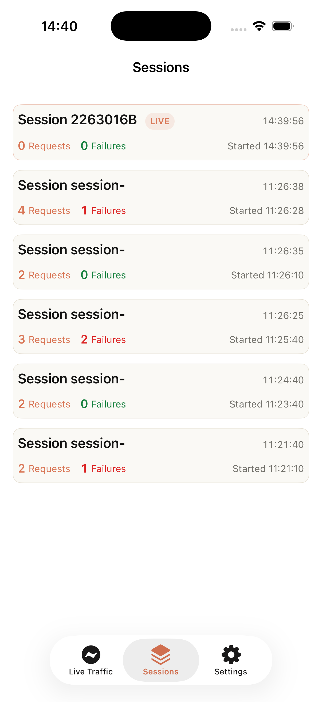
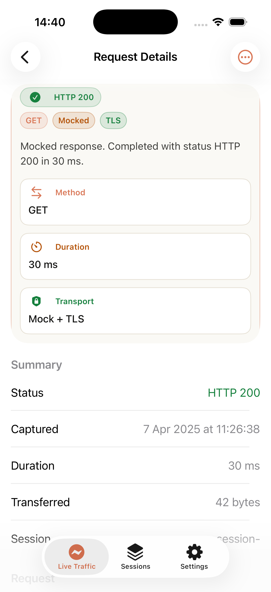
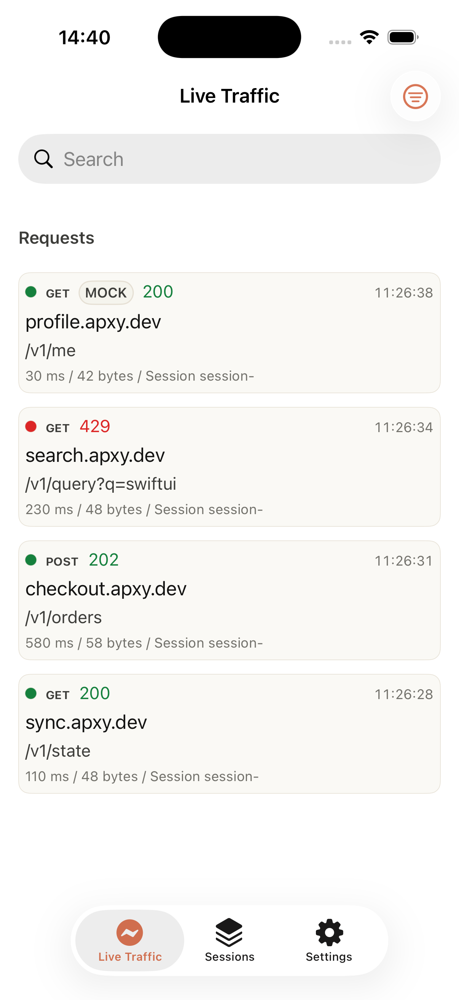
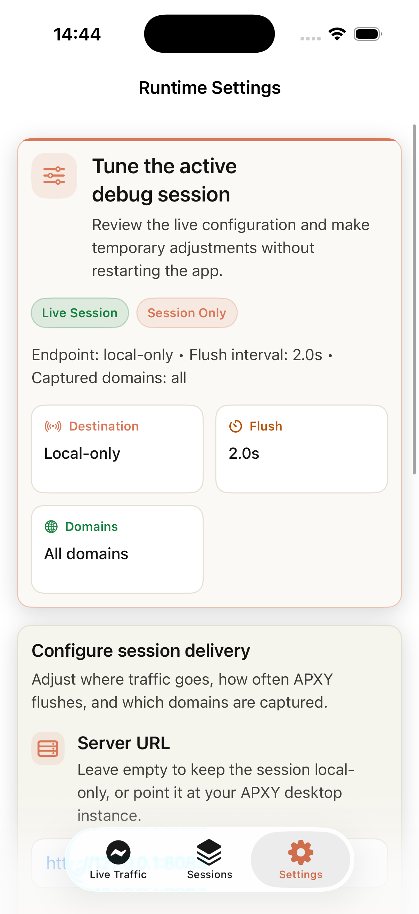

# Apxy iOS

`Apxy iOS` captures `URLSession` traffic from your app.

Use it in one of two ways:

- `ApxyCore` to capture and deliver traffic
- `ApxyUI` to inspect captured traffic inside the app with an embedded debug console

You can keep everything local on-device, or send sessions and records to [APXY](https://github.com/apxydev/apxy) for inspection in the Web UI and CLI.

## What You Get

- Automatic capture for `URLSession.shared`
- Capture for default and ephemeral sessions created after startup
- Compatibility with libraries built on top of `URLSession`
- Local in-app inspection with `ApxyUI`
- Remote delivery to APXY using signed ingest credentials

## Installation

Add the package through Swift Package Manager:

```swift
dependencies: [
    .package(url: "https://github.com/apxydev/apxy-ios", from: "0.1.0")
]
```

Choose the product that matches your integration:

- `ApxyCore` if you only need capture and transport
- `ApxyUI` if you also want the embedded debug console

```swift
.product(name: "ApxyCore", package: "apxy-ios")
.product(name: "ApxyUI", package: "apxy-ios")
```

## Quick Start

Start Apxy as early as possible, ideally in `App.init` or app launch.

### Local-Only Capture

```swift
import ApxyCore

Apxy.start()
```

`Apxy.start()` is the simplest setup:

- capture stays local to the device
- the embedded debug console is enabled by default
- no extra runtime configuration is required

### Remote Capture With APXY

If you want to send captured sessions and traffic logs to APXY, configure `ApxyOptions.remote` with both the APXY server URL and the signed ingest credentials generated by APXY Core.

```swift
import ApxyCore

Apxy.start(
    options: ApxyOptions(
        remote: .init(
            serverURL: "http://<your-mac-lan-ip>:8083",
            ingestCredentials: .init(
                keyID: "<sdk-key-id>",
                clientSecret: "<sdk-client-secret>"
            )
        )
    )
)
```

Remote delivery notes:

- remote configuration is atomic: `serverURL` and credentials live together under `ApxyOptions.remote`
- protected remote ingest currently uses signed HTTP delivery
- `http://` desktop endpoints are allowed automatically in `DEBUG` builds for local development
- non-`DEBUG` builds require HTTPS for remote delivery
- if remote delivery is invalid, startup is rejected instead of silently downgrading to local-only

## Embedded Debug Console

Present the console anywhere in your app:

```swift
import SwiftUI
import ApxyUI

struct DebugScreen: View {
    var body: some View {
        ApxyDebugConsoleContainer()
    }
}
```

The embedded console is useful for:

- browsing captured sessions and requests
- inspecting request and response details
- reviewing live traffic
- adjusting runtime-only settings such as `serverURL`, `keyID`, `clientSecret`, `flushInterval`, and `capturedDomains`

If you need full manual control, configure `debugConsole` explicitly through `ApxyOptions`. Pass `debugConsole: .disabled` to turn the embedded console off.

When remote delivery is enabled, keep the debug console disabled unless you actively need it. Running both together increases capture and persistence overhead.

### Screenshots

| Sessions | Request Details |
| --- | --- |
|  |  |

| Live Traffic | Runtime Settings |
| --- | --- |
|  |  |

## APXY

APXY is a local HTTP/HTTPS debugging proxy and traffic inspection tool for developers and AI coding agents. It lets you capture, inspect, mock, replay, and diff traffic from a CLI and Web UI.

- GitHub: https://github.com/apxydev/apxy
- Website: https://apxy.dev

## APXY Pro

APXY has a free tier for first capture, but the full remote workflow is aimed at APXY Pro.

If you want to keep sending SDK sessions and traffic logs without free-tier limits, use APXY Pro. It unlocks unlimited traffic history together with the full replay, diff, and advanced debugging workflow in APXY.

## Documentation

- Full configuration reference: [docs/configuration.md](docs/configuration.md)

## Requirements

| Module | Platforms |
| --- | --- |
| `ApxyCore` | iOS 15+, macOS 12+ |
| `ApxyUI` | iOS 16+, macOS 13+ |

## License

MIT
